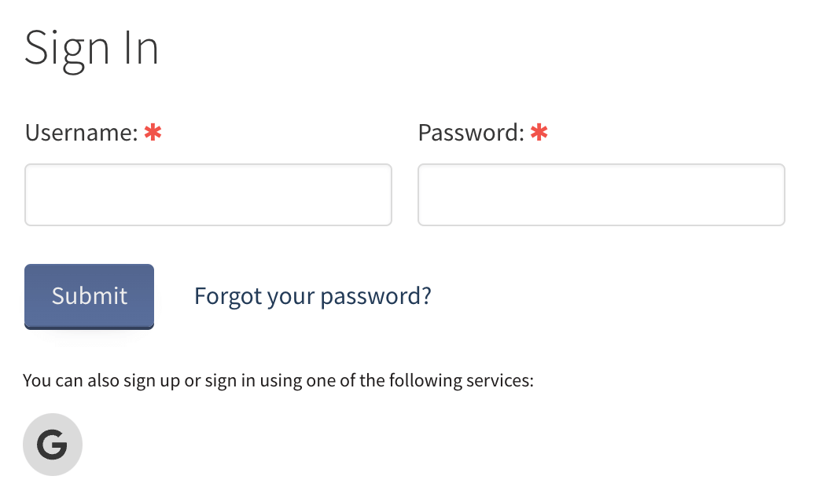

# Authorization

There're two ways to get access to the admin panel: built-in Heretic user database or OAuth2 provider.

## Heretic Account

1. Proceed to your website URL (http://127.0.0.1:3001 by default)
2. Choose *Sign in* option in the right upper corner by clicking the profile icon
3. Use the credentials below to log in (default values):
+ Login: *admin*
+ Password: *password*

## OAuth2

To authorize via Google (as an example) account you need:

1. Proceed to your website URL (http://127.0.0.1:3001 by default)
2. Choose *Sign in* option in the right upper corner by clicking the profile icon
3. Click on the Google icon under the *Submit* button
4. Authorize using your Google account
