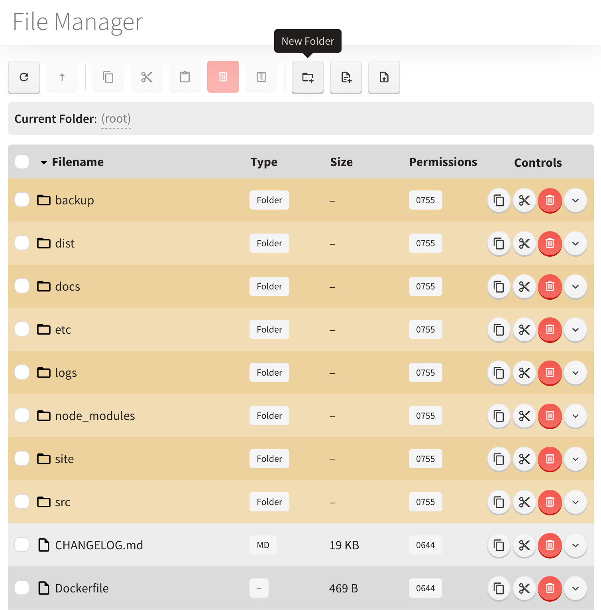
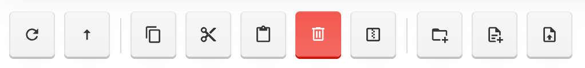
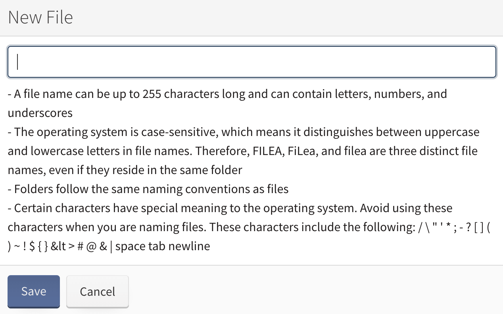

# File Manager

This module is serving for the purpose of managing the files saved and stored within Heretic, both files and folders.

It resembles a table with the listed files, divided by

+ *Filename* - the name of the listed file, with extension
+ *Type* - the extension of the file (folder, text file, JSON, etc.)
+ *Size* - the size of the file
+ *Permission* - permissions (chmod) set to file
+ *Controls* - the buttons allowing to perform different actions

To the left upper corner, there is a toolbar located for managing the table, as well as creating/deleting the files:

+ *Refresh* - refreshes the folder contents for the update
+ *Parent folder* - returns the user back to parent folder
+ *Copy* - add the files or folders to the clipboard for a copy
+ *Move* - add the files or folders to the clipboard for a move
+ *Paste* - paste the files/folders saved to the clipboard previously
+ *Delete* - delete the chosen files or folders from the disk
+ *New Folder* - create new folder
+ *New File* - create new editable (text) file, to be listed and stored
+ *Upload* - allows to upload the file from the disk

# Create a New Folder

1. Click on the button *New Folder* at the toolbar
2.  Name the new folder according to the rules listed in the new window, entering the name in the only available field
3. Click on *Save* button

# Create a New File

1. Click on the button *New file* at the toolbar.
2. Name the new folder according to the rules listed in the new window, entering the name in the only available field
   

3. Click on *Save* button

# Upload a File

1. Click on the *Upload* button
2. Select one or several files stored on your computer
3. Click on *Submit* button

# Delete a File or Folder

1. Choose the file from the tree by checking it, and click on the *Delete* button at the toolbar, or at *Controls* tab
2. Click on *Submit* button in the appearing window
