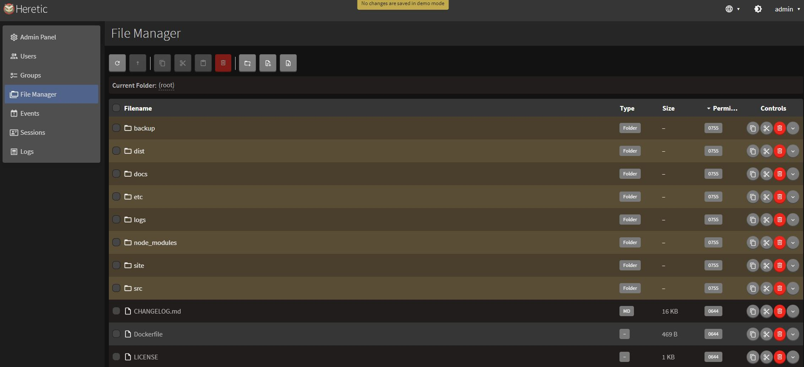
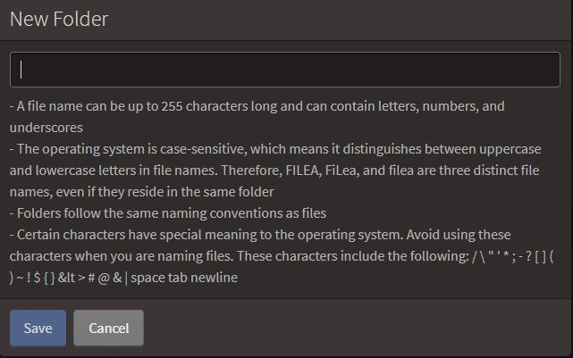
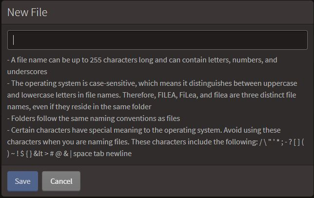

## File manager
---
This page is serving for the purpose of managing the files saved and stored within Heretic, both documents and folders.

It resembles a table with the listed files, divided by
+ *Filename* - the name of the listed file, with extention;
+ *Type* - the extension of the file (folder, text file, .json, etc.)
+ *Size* - the size of the forementioned file.
+ *Permission* - shows what group_id has access to that file for reading/editing.
+ *Controls* - the buttons allowing to edit the chosen file.

To the left upper corner, there is a toolbar located for managing the table, as well as creating/deleting the files:
+  Refresh - refreshes the page for the update.
+  *Parent folder* - returns the user back to parent folder.
+  *Copy* - copies the chosen file, saving it to the buffer.
+  *Cut* - cuts the chosen file, saving it to the buffer.
+  *Paste* - pastes the file saved to the buffer previously.
+  *Delete* - deletes the chosen file from the File system.
+  *New Folder* - creates new folder in the system.
+  *New File* - creates new file, to be listed and stored.
+  *Upload* - allows the user to upload the file from their disk space to Heretic.

# To create a new folder:
1. Click on the button  "New Folder" at the toolbar.
2.  Name the new folder according to the rules listed in the new window, entering the name in the only available field.

3. Click on "Save" button. 

# To create a new file:
1. Click on the button  "New file" at the toolbar.
2. Name the new folder according to the rules listed in the new window, entering the name in the only available field.

3. Click on "Save" button. 

# To upload the file:
1. Click on the  "Upload" button.
2. Select one or several files stored on your PC.
3. Click on "Submit" button.

# To delete the file:
1. Choose the file from the tree by marking it, and click on the ](toolbarDelete.JPG) "Delete" button at the toolbar, or at "Controls" tab.
2. Click on "Submit" button in the appearing window.
