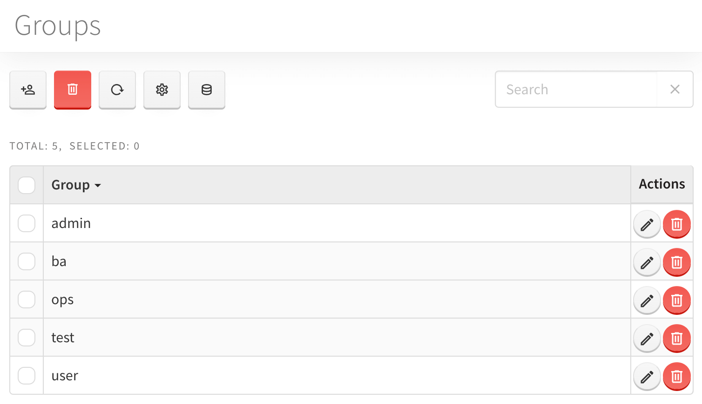
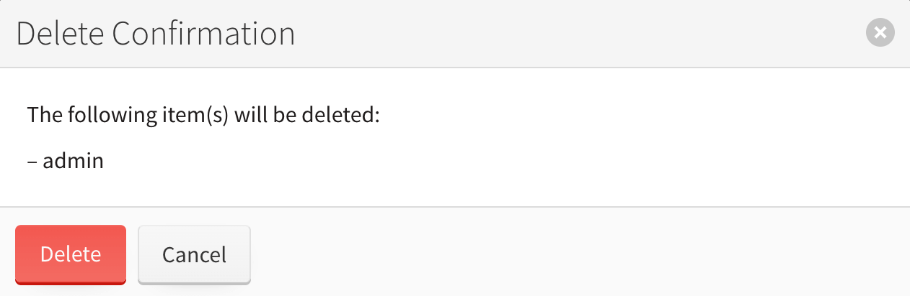

# Groups Module

Groups module allows the admin to manage user groups they belong to, create new groups or delete the existent ones. The groups define the clearance and accesses users have.

To create a new group:

1. Click *Add Group* button
2. Enter the new group name in the text field
3. Click *Add* button to add the required group parameter
4. Set the required value
5. Click *Save* button to apply changes

Your new created group should appear in the list. You can assign users to it at Users module.

To delete the group, you should perform the steps below:

1. Choose the one or several entries you want to delete
2. Click *Delete* button in the upper side of the page

3. Click *Delete* in the confirmation dialog

The *Reload* button on User tab will allow you to refresh te page to see the changes made to the list.

By clicking the *Data* button you may be able to export the list contents to Excel or tab-separated values file.

To perform the export:

1. Select the items to export by clicking on the checkbox in front of each entry you pick, or apply the filter to the list and pick all
2. Click *Data* &rarr; *Export to file*. In the appeared window you'll see the amount of items for export, export type (Excel or Tab-Separated Values) and each entry's contents you can adjust to export
3. Press *Export* button to initiate the process