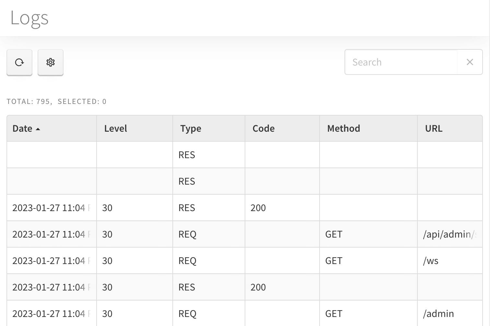

# Logs Module

Logs module allows the admin to see the list of all server-related activity.

By clicking the *Data* button you may be able to export the list contents to Excel or tab-separated values file.

To perform the export:

1. Select the items to export by clicking on the checkbox in front of each entry you pick, or apply the filter to the list and pick all
2. Click *Data* &rarr; *Export to file*. In the appeared window you'll see the amount of items for export, export type (Excel or Tab-Separated Values) and each entry's contents you can adjust to export
3. Press *Export* button to initiate the process