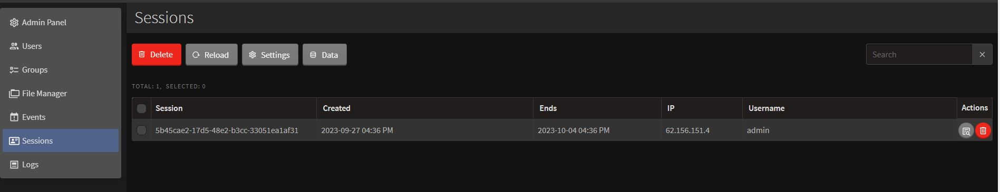
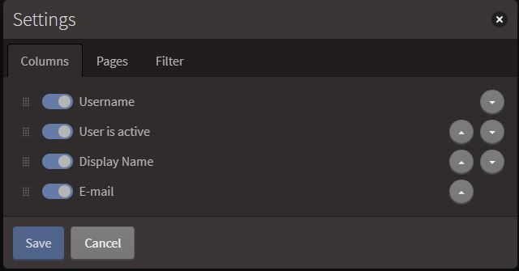

# Sessions Module

Session module shows the list of active and ended sessions performed by users. Each entry is automatically created once the user logs in the system and ends once they log out or the connection to the service is interrupted.

Settings buttons functional is: sorting the list of sessions and adjusting it's visual. By clicking on it, you'll see three tabs appearing in a new window: Columns, Pages and Filter.

](./images/sessionSettings.jpg)

+ Columns tab will allow you to switch types of data being shown in every entry (Session ID, creation date, end session time, IP address etc.)
+ Pages will give you an option to change how many list entries are visible within one page
+ Filter tab will help you create the filters for user list and apply the existent ones, which were previously created and saved

To add new filter:

1. Click "New" icon
2. Pick the data filter (Session ID, creation date, etc.)
3. Choose the condition from the list (equals/not equals/is like/is not like etc.)
4. Enter the data you aim to filter for
5. Click "Save" button

By clicking the "Data" button you may be able to export the list contents to Excel or tab-separated values file.

To export data:

1. Select the items to export by clicking on the checkbox in front of each entry you pick, or apply the filter to the list and pick all
2. Click "Data" &rarr; "Export to file". In the appeared window you'll see the amount of items for export, export type (Excel or Tab-Separated Values) and each entry's contents you can adjust to export
3. Press "Export" button to initiate the process

To delete the entry, you may perform the steps below:

1. Choose the one or several entries you want to delete
2. Click "Delete" button in the upper side of the page
3. Click "Delete" on the confirmation window
