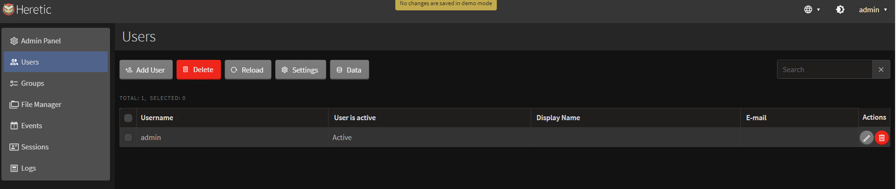

## Users module
---
User tab functionality allows to get the list of users who're registered in the system and data regarding each entry.

Admin can use his tab to create new user, delete or sort the existent entries by filtering, as well as export the search results to Excel file.

Creating new user:
1. Click "Add user" button in the upper side of the screen.
2. Fill up the data in each field accordingly: username (their name in the system), user's active status (switched by pressing the check icon, binary), displayed name(the name which will get shown instead of username where aplicable), Email of the new user, password, and choosing the group (by clicking "add" button).
3. When finished, click the "Add" button.
There's also an option to turn off the two-factor authentification, by clicking "Disable 2FA".

New user entry will appear on the list with all data added during the creation process.

To delete the user, you should perform the steps below:
1. Choose the one or several entries you want to delete.
2. Click "Delete" button in the upper side of the page.
3. Click "Yes" on the confirmation window.

The button "Reload" on User tab will allow you to refresh te page to see the changes made to the list.

Settings button's functional is sorting the list of users and adjustisting it's visual. By clicking on it, you'll see three tabs appearing in a new window: Columns, Pages and Filter.
+ Columns tab will allow you to switch types of data being shown in every entry (Username, is user active or not, display name and Email).
+ Pages will give you an option to change how many list entries are seen within one page.
+ Filter tab will help you create the filters for user list and apply the existent ones, which were previously created and saved.

To add new filter:
1. Click "+New" icon.
2. Pick the data's filter point (username, activity status, email, display name)
3. Choose the condition from the list (equals/not equals/is like/is not like)
4. Enter the data inside the empty field you aim to filter for.
5. Click "Save" button.

After the filter got saved, you can toggle it on/off to apply it for the list; to save changes, press "Save".

By clicking the button "Data", you may be able to export the list contents to Excel or tab-separated values file.

To perform this:
1. Select the items to import by clicking on the checkbox in fron of each entry you pick, or apply the filter to the list and pick all.
2. Click "Data" -> "Export to file". In the appeared window you'll see the amount of items for export, export type (Excel/Tab-separated values) and each entry's contents you can adjust to export.
3. Press "Export" button to initiate the process.
